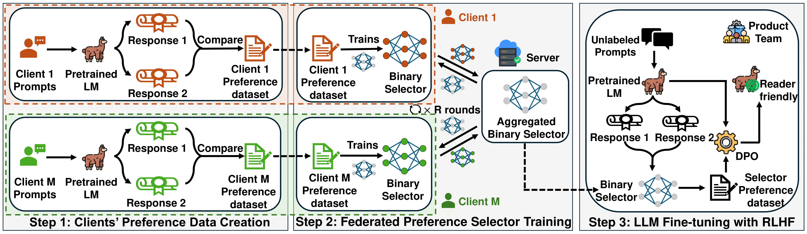
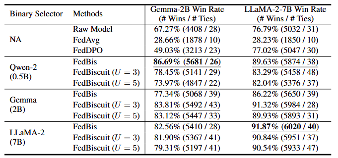
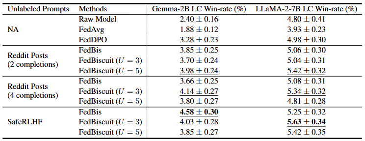

# FedBis/FedBiscuit: Towards Federated RLHF with Aggregated Client Preference for LLMs


[](https://federatedscope.io/)
[](https://try.federatedscope.io/)
[](https://federatedscope.io/docs/contributor/)



FedBis/FedBiscuit is a federated learning framework that enables reinforcement learning with human feedback (RLHF) for large language models (LLMs) without compromising user privacy. This codebase—forked from [FederatedScope](https://github.com/alibaba/FederatedScope) and [FedBiOT](https://github.com/HarliWu/FedBiOT)—supports bfloat16 precision and MultiGPU training.

---

## Overview

**Key Features:**
- **Federated Preference Collection:** Each client trains a lightweight binary selector on local data. The server aggregates these selectors to simulate a large-scale preference dataset.
- **Two Training Phases:**  
  1. **Federated Preference Selector Training (FedBis):** Learn common user preferences via federated learning.
  2. **LLM Fine-tuning with RLHF:** Use the aggregated binary selector(s) to fine-tune a pre-trained LLM through reinforcement learning.

**Why FedBis/FedBiscuit?**
- **Privacy-Preserving:** Users do not need to share their raw preference data.
- **Computational Efficiency:** The binary selector avoids heavy computations compared with traditional reward model training.
- **Enhanced Alignment:** The aggregated selector improves the LLM’s content professionalism and readability.
- **FedBiscuit Extension:** To tackle preference heterogeneity and reward hacking, FedBiscuit clusters clients and trains multiple selectors for robust performance.

---

## Installation

Before you run the code, set up your environment and install FS-LLM (which is integrated into this repository). Follow these steps:

1. **Create a Conda Environment:**
   ```bash
   conda create -n fs-llm python=3.9
   conda activate fs-llm
   ```

2. **Install PyTorch (>=1.13.0):**
   ```bash
   conda install pytorch==2.0.0 torchvision==0.15.0 torchaudio==2.0.0 pytorch-cuda=11.7 -c pytorch -c nvidia
   ```

3. **Install FS-LLM in Editable Mode:**
   ```bash
   pip install -e .[llm]
   ```

You are now ready to use FS-LLM.

---

## Training

The training process is divided into two phases:

### Phase 1: Federated Preference Selector Training

1. **Prepare the Configuration File:**  
   Create a YAML file (e.g., `fedbiscuit_script/tldr/tldr_choice_gemma_fedbiscuit_u3.yaml`) with the settings for your task. An example configuration is shown below:

    ```yaml
    # Whether to use GPU
    use_gpu: True

    # Deciding which GPU to use
    device: 0

    # Early stop steps, set `0` to disable
    early_stop:
      patience: 0

    # Federate learning setting for TLDR task
    federate:
      mode: standalone
      client_num: 53
      # Number of clients sampled per round
      sample_client_num: 5
      # Number of communication round
      total_round_num: 500
      # Saving path for checkpoinnt
      save_to: "checkpoints/tldr_choice_gemma_fedbiscuit_u3.ckpt"
      ignore_weight: True
      save_freq: 50
      share_local_model: True
      online_aggr: False

    # Dataset for TLDR task (selector training phase)
    data:
      root: data/
      type: 'reddit-tldr-comparison-choice@llm'
      splits: [0.9,0.09,0.01]
      splitter: 'meta'

    # LLM related options
    llm:
      tok_len: 1024
      # Gradient accumulation steps
      grad_accum_step: 2
      chat:
        max_len: 1024
      adapter:
        use: True
        args: [ { 'adapter_package': 'peft', 'adapter_method': 'lora', 'r': 8, 'lora_alpha': 16, 'lora_dropout': 0.05 } ]

        # skip the following setting for FedBis
        count: 3
        warmup:
          use: True
          round: 50
        grouping:
          use: True
          round: 50
        
    # DataLoader related options
    dataloader:
      # Batch size for iter loader (for a single update, the actual batch size is batch_size*grad_accum_step)
      batch_size: 8

    # Model related options
    model:
      # Model type (format: {MODEL_REPO}@huggingface_llm)
      type: 'google/gemma-2b@huggingface_llm'

    # Training related options for a binary selector
    train:
      # Number of local update steps
      local_update_steps: 30
      batch_or_epoch: batch
      optimizer:
        type: AdamW
        betas: (0.9, 0.95)
        lr: 0.00001
      is_enable_half: True
    criterion:
      type: CrossEntropyLoss
    trainer:
      type: llmrewardchoicetrainer
      choices: ['A', 'B']
    eval:
      freq: 50
      metrics: ['loss', 'acc']
      best_res_update_round_wise_key: test_loss
      count_flops: False

    # Specify the path to store the experimental results
    expname: tldr/choice_gemma/fedbiscuit_u3
    ```

2. **Run the Training Script:**  
   Execute the training with your configuration:
   ```bash
   CUDA_LAUNCH_BLOCKING=1 CUDA_VISIBLE_DEVICES=0 \
   PYTORCH_CUDA_ALLOC_CONF=expandable_segments:True python federatedscope/main.py --cfg fedbiscuit_script/tldr/tldr_choice_gemma_fedbiscuit_u3.yaml
   ```

   To enable multi-GPU training with Accelerate, run:
   ```bash
   CUDA_LAUNCH_BLOCKING=1 CUDA_VISIBLE_DEVICES=0,1 PYTORCH_CUDA_ALLOC_CONF=expandable_segments:True \
   accelerate launch --config_file fedbiscuit_script/accelerator_config_bf16.yaml federatedscope/main.py \
   --cfg fedbiscuit_script/tldr/tldr_choice_gemma_fedbiscuit_u3.yaml llm.accelerator.use True
   ```

### Phase 2: LLM Fine-tuning with RLHF

1. **Prepare the Fine-tuning YAML File:**  
   Create a YAML file (e.g., `fedbiscuit_script/tldr/tldr_rlhf_fedbiscuit_gemma.yaml`) for RLHF fine-tuning. An example configuration is:

    ```yaml
    # Whether to use GPU
    use_gpu: True

    # Deciding which GPU to use
    device: 0

    # Early stop steps, set `0` to disable
    early_stop:
      patience: 0

    # Federate learning related options
    federate:
      mode: standalone
      client_num: 1
      total_round_num: 150
      # Replace <choice_ckpt> with a stored federated preference selector
      save_to: "checkpoints/tldr_rlhf_gemma_<choice_ckpt>.ckpt"
      save_freq: 50
      share_local_model: True
      online_aggr: False

    # Dataset for TLDR task (RLHF phase)
    data:
      root: data/
      type: 'reddit-tldr-rlhf@llm'
      splits: [0.9,0.09,0.01]
      splitter: 'iid'

    # RLHF Fine-tuning related options 
    llm:
      rlhf: True
      tok_len: 1024
      max_new_token: 80
      chat:
        max_len: 1024
      adapter:
        use: True
        args: [ { 'adapter_package': 'peft', 'adapter_method': 'lora', 'r': 8, 'lora_alpha': 16, 'lora_dropout': 0.05 } ]
      # DPO beta value
      reward_coeff: 0.1
      # Gradient accumulation steps
      grad_accum_step: 8

    # DataLoader related options
    dataloader:
      # Batch size for iter loader (for a single update, the actual batch size is batch_size*grad_accum_step)
      batch_size: 4

    # Model related options
    model:
      # Model type (format: {MODEL_REPO}@huggingface_llm)
      type: 'mlabonne/Gemmalpaca-2B@huggingface_llm'

    # Training related options for a binary selector
    train:
      local_update_steps: 30
      batch_or_epoch: batch
      optimizer:
        type: RMSprop
        lr: 0.000001
      is_enable_half: True
    criterion:
      type: CrossEntropyLoss
    trainer:
      type: llmrewardtrainer
    eval:
      freq: 50
      metrics: ['loss', 'acc']
      best_res_update_round_wise_key: val_loss
      count_flops: False

    # Specify the path to store the experimental results, replace <choice_ckpt> with a stored federated preference selector
    expname: tldr/rlhf_gemma/<choice_ckpt>
    ```

2. **Run the RLHF Fine-tuning Script:**  
   Use the selector configuration file from Phase 1 (e.g., `fedbiscuit_script/tldr/tldr_choice_gemma_fedbiscuit_u3.yaml`) as an argument:
   ```bash
   CUDA_LAUNCH_BLOCKING=1 CUDA_VISIBLE_DEVICES=0 \
   PYTORCH_CUDA_ALLOC_CONF=expandable_segments:True python federatedscope/llm/rlhf/main.py \
   --selector-cfg-file fedbiscuit_script/tldr/tldr_choice_gemma_fedbiscuit_u3.yaml \
   --cfg fedbiscuit_script/tldr/tldr_rlhf_fedbiscuit_gemma.yaml llm.accelerator.use True \
   federate.save_to checkpoints/tldr_rlhf_gemma__tldr_choice_gemma_fedbiscuit_u3.ckpt \
   expname tldr/rlhf_gemma/tldr_choice_gemma_fedbiscuit_u3
   ```

   For multi-GPU training, use:
   ```bash
   CUDA_LAUNCH_BLOCKING=1 CUDA_VISIBLE_DEVICES=0,1 PYTORCH_CUDA_ALLOC_CONF=expandable_segments:True \
   accelerate launch --config_file fedbiscuit_script/accelerator_config_bf16.yaml federatedscope/llm/rlhf/main.py \
   --selector-cfg-file fedbiscuit_script/tldr/tldr_choice_gemma_fedbiscuit_u3.yaml \
   --cfg fedbiscuit_script/tldr/tldr_rlhf_fedbiscuit_gemma.yaml llm.accelerator.use True \
   federate.save_to checkpoints/tldr_rlhf_gemma__tldr_choice_gemma_fedbiscuit_u3.ckpt \
   expname tldr/rlhf_gemma/tldr_choice_gemma_fedbiscuit_u3
   ```

---

## Evaluation

Evaluation procedures vary with the task. Here are the two main setups:

### TLDR Summarization Task

1. **Run Summarization Evaluation on Different Checkpoints:**  
   Replace the checkpoint file name in the command accordingly.
   ```bash
   # Evaluation at 50 rounds:
   CUDA_LAUNCH_BLOCKING=1 CUDA_VISIBLE_DEVICES=0 \
   PYTORCH_CUDA_ALLOC_CONF=expandable_segments:True python federatedscope/llm/eval/eval_for_tldr/eval_summarization.py \
   --selector-cfg-file fedbiscuit_script/tldr/tldr_choice_gemma_fedbiscuit_u3.yaml \
   --cfg fedbiscuit_script/tldr/tldr_rlhf_fedbiscuit_gemma.yaml llm.accelerator.use False \
   federate.save_to checkpoints/50_tldr_rlhf_gemma__tldr_choice_gemma_fedbiscuit_u3.ckpt \
   expname eval_tldr/rlhf_gemma/tldr_choice_gemma_fedbiscuit_u3 train.is_enable_half True
   ```

2. **Run Auto-J Evaluation:**  
   To compare generated summaries with human annotations:
   ```bash
   CUDA_LAUNCH_BLOCKING=1 CUDA_VISIBLE_DEVICES=0 \
   PYTORCH_CUDA_ALLOC_CONF=expandable_segments:True python federatedscope/llm/eval/eval_for_tldr/auto_j_vllm.py \
   --model-outputs-directory exp/tldr/rlhf_gemma/tldr_choice_gemma_fedbiscuit_u3/_summarization.txt --pairwise
   ```

### SHP (Question Answering) Task

1. **Run QA Evaluation:**  
   ```bash
   CUDA_LAUNCH_BLOCKING=1 CUDA_VISIBLE_DEVICES=0 \
   PYTORCH_CUDA_ALLOC_CONF=expandable_segments:True python federatedscope/llm/eval/eval_for_AlpacaEval/eval_winrate.py \
   --cfg fedbiscuit_script/shp/shp_rlhf_fedbiscuit_gemma.yaml federate.saveto {checkpoint_name} \
   llm.accelerator.use False expname eval_shp/rlhf_gemma/{checkpoint_name}
   ```
   After this command, an `alpaca_eval.json` file will be generated. You can then use GPT-4-turbo to compare the outputs.

---

## Results

The figures below are the results as reported in our paper:

- **TLDR Summarization:**

  

- **SHP QA:**

  

---

## Citation

If you use FedBis/FedBiscuit in your research, please cite our work as follows:

```
@inproceedings{wu2025towards,
  title={Towards Federated RLHF with Aggregated Client Preference for LLMs},
  author={Wu, Feijie and Liu, Xiaoze and Wang, Haoyu and Wang, Xingchen and Su, Lu and Gao, Jing},
  booktitle={The Thirteenth International Conference on Learning Representations},
  year={2025}
}

@inproceedings{wu2024fedbiot,
  author = {Wu, Feijie and Li, Zitao and Li, Yaliang and Ding, Bolin and Gao, Jing},
  title = {FedBiOT: LLM Local Fine-tuning in Federated Learning without Full Model},
  year = {2024},
  booktitle = {Proceedings of the 30th ACM SIGKDD Conference on Knowledge Discovery and Data Mining},
  pages = {3345–3355}
}

@inproceedings{kuang2024federatedscope,
  author = {Kuang, Weirui and Qian, Bingchen and Li, Zitao and Chen, Daoyuan and Gao, Dawei and Pan, Xuchen and Xie, Yuexiang and Li, Yaliang and Ding, Bolin and Zhou, Jingren},
  title = {FederatedScope-LLM: A Comprehensive Package for Fine-tuning Large Language Models in Federated Learning},
  year = {2024},
  booktitle = {Proceedings of the 30th ACM SIGKDD Conference on Knowledge Discovery and Data Mining},
  pages = {5260–5271}
}

@article{federatedscope,
  title = {FederatedScope: A Flexible Federated Learning Platform for Heterogeneity},
  author = {Xie, Yuexiang and Wang, Zhen and Gao, Dawei and Chen, Daoyuan and Yao, Liuyi and Kuang, Weirui and Li, Yaliang and Ding, Bolin and Zhou, Jingren},
  journal={Proceedings of the VLDB Endowment},
  volume={16},
  number={5},
  pages={1059--1072},
  year={2023}
}
```
